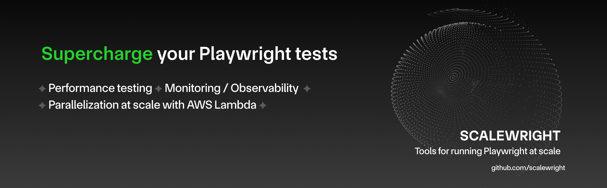
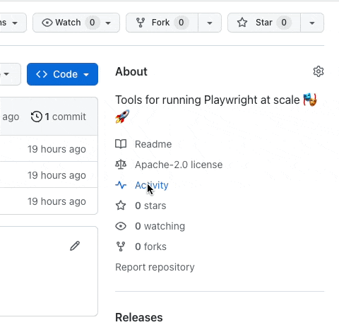

# Scalewright

This project aims to provide a number of features which are useful to teams that have large Playwright test suites and run Playwright at scale.

* **Performance testing and measurement**. Use existing Playwright test suites to measure and report Core Web Vitals of your web apps.
* **Monitoring & observability.** Connect your Playwright tests to CloudWatch, Datadog, Honeycomb, Lightstep, and more. You can then create dashboards and visualize trends. [_Coming soon_](#get-notified-for-updates)
* **Drop-in, no code changes required.** Scalewright is designed to just work and require minimal extra configuration.
* **Parallelize at scale**. Parallelize and run test suites faster on AWS Lambda.  [_Coming soon_](#get-notified-for-updates)

**Note:** This project is brought to you by [Artillery](https://www.artillery.io). This project **is not affiliated with the Playwright team or Microsoft**. We're sharing something we built with other power users of Playwright to help them do even more with Playwright.

# Performance Testing

## Description

This lets you use your Playwright test suites for **performance testing and measurement**.

Scalewright extends Playwright with automatic tracking of [Web Vitals](https://web.dev/vitals/). The following metrics will be tracked by all [`page`]((https://playwright.dev/docs/api/class-page)) actions in every [`test`](https://playwright.dev/docs/writing-tests#first-test) block:

* `LCP`
* `FID`
* `CLS`
* `FCP`
* `TTFB`

Learn more about Web Vitals on https://web.dev/vitals/

## Getting Started

You can enable performance testing  in two ways:

1. Automatic instrumentation with `@scalewright/test` in your imports
2. Manual instrumentation with `@scalewright/performance-tracking`

### Method 1: automatic instrumentation with `@scalewright/test`

This method requires updating only a single line of code in your test suite.

Install `@scalewright/test` alongside Playwright (i.e. usually as a `devDependency` in a Node.js project):

```sh
npm install -D @scalewright/test
```

And then replace `@playwright/test` with `scalewright/test` in your imports:

```js
// Before:
// import { test, expect } from '@playwright/test';

// After:
import { test, expect } from '@scalewright/test';

// Continue using the "test" helper as normal.
test('has title', async ({ page }) => {
  await page.goto('https://playwright.dev/');
  await expect(page).toHaveTitle(/Playwright/);
});
```

That's it. That will extend the built-in `page` fixture under the hood (using the official Playwright [fixture override API](https://playwright.dev/docs/test-fixtures#overriding-fixtures)). Everything else is simply re-exported from `@playwright/test` so things like `expect` work as normal.

### Method 2: use `@scalewright/performance-tracking` directly

If you can't replace the imports for some reason, you can extend the `page` fixture yourself.

Install alongside Playwright (i.e. usually as a `devDependency` in a Node.js project):

```sh
npm install -D @scalewright/performance-tracking
```

And then extend the built-in `page` fixture (uses Playwright's official [fixture override API](https://playwright.dev/docs/test-fixtures#overriding-fixtures) under the hood):

```js
// Import Playwright Test runner's "test" helper as a different name so that
// we can extend it:
import { test as base, expect } from '@playwright/test';

// Extend it to track performance tracking and leaving everything else as-is:
import { withPerformanceTracking } from '@scalewright/performance-tracking';
const test = withPerformanceTracking(base);

// Use the "test" helper as normal
test('has title', async ({ page }) => {
  await page.goto('https://playwright.dev/');
  await expect(page).toHaveTitle(/Playwright/);
});
```

This will need to be done in every file that uses Playwright Test Runner.

# Monitoring & Observability

This connects your Playwright tests to external monitoring/observability systems (such as Datadog, CloudWatch, Honeycomb or any other provider that supports StasD or OpenTelemetry protocols). Test metrics, traces, and events can then be sent over for visibility and analysis.

_Coming soon_ - [get notified for updates](#get-notified-for-updates)

# Parallelize at scale

Scale out your Playwright test suite on AWS Lambda for a massive speed up and reduction in running time. This requires no DevOps or infra work - a serverless "grid" is created on the fly in your own AWS account. This is orders of magnitude cheaper than cloud hosted platforms for running large Playwright tests.

_Coming soon_ - [get notified for updates](#get-notified-for-updates)

# Get notified for updates

The best way to be notified is to Watch releases and discussions on the repo:



# Versioning

This project will aim to follow the release schedule of Playwright.

Each release will be versioned as follows: `major.minor.patch-n` where `major.minor.patch` will match a specific version of Playwright, and `n` is a release number of Scalewright itself. To illustrate it with an example:

1. Playwright release version `1.37.1`
2. Scalewright version `1.37.1-0` is published. The `1.37.1` part tells you which release of Playwright this version of Scalewright works with. `-0` means it's the first release of Scalewright for Playwright v1.37.1.
3. A user reports a bug in Scalewright, we fix it and publish Scalewright `v1.37.1-1`. This is now the latest release of Scalewright that is intended to work with Playwright `v1.37.1`.

# License

Apache 2.0 (same as Playwright)
